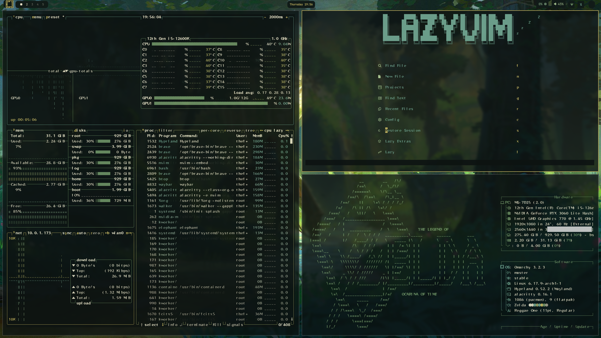

# Zelda Twilight Princess Theme

A dark green, brown, and gold Omarchy theme inspired by **The Legend of Zelda: Twilight Princess** — twilight forests, aged ruins, and royal gold accents. Everything is tuned to feel earthy, muted, and readable in a dark room.



---

## Design Notes
- **Twilight darkness**: Deep forest-black backgrounds that keep glare low.
- **Hylian gold**: Gold highlights for focus, selections, and important UI.
- **Forest greens**: Soft, mossy greens and teals for secondary accents.
- **One palette everywhere**: Terminals, bar, lockscreen, OSD, Neovim, Cursor/VS Code, and cursor theme are all aligned.

---

## Color Palette

### Core Shades
| Purpose     | Hex       |
|------------|-----------|
| Background | `#0c1312` |
| Foreground | `#e2ddc3` |
| Muted      | `#9e9a88` |

### Accents
| Role        | Hex       |
|------------|-----------|
| Gold       | `#C9B962` |
| Moss Green | `#6D9064` |
| Forest Teal| `#6CA08C` |
| Soft Green | `#90B791` |
| Pale Green | `#ABC894` |
| Olive      | `#9BA064` |

These are mapped consistently across apps (terminals, waybar, btop, Hyprland, etc.).

---

## What’s Themed
- **Alacritty** (`alacritty.toml`) — full Zelda terminal palette, gold cursor, forest selections.
- **Kitty** (`kitty.conf`) — matching palette, gold borders, mossy selections.
- **Ghostty** (`ghostty.conf`) — bound to the Zelda theme name.
- **Waybar** (`waybar.css`) — dark bar with gold accent and cream text.
- **Mako** (`mako.ini`) — dark notifications with gold borders and light text.
- **Btop** (`btop.theme`) — single clean Zelda theme with green/gold gradients.
- **Hyprland** (`hyprland.conf`) — gold active borders.
- **Hyprlock** (`hyprlock.conf`) — dark lockscreen with gold and soft greens.
- **Walker & share picker** (`walker.css`, `hyprland-preview-share-picker.css`) — launchers themed to the same palette.
- **SwayOSD** (`swayosd.css`) — volume/brightness OSD in green/gold.
- **Chromium** (`chromium.theme`) — background tuned to the dark base.
- **Neovim** (`neovim.lua`) — Zelda palette (no blue, only greens/golds/browns).
- **Cursor / VS Code** (`vscode.json`) — points Cursor/VS Code at the Official Zelda-Dark theme, which is also tinted via Neovim/terminal to match the overall feel.
- **Icons & cursor** (`icons.theme`, `cursor.theme`) — `Yaru-olive` for file manager icons and cursor, matching the forest-green look.

---

## Install

If this theme is published on a git host, you can install it via Omarchy:

```bash
omarchy-theme-install https://github.com/USERNAME/omarchy-zelda-theme
```

Then in the Omarchy menu:
- `Style > Theme > zelda`

---

## Wallpaper Ideas
- Twilight Princess concept art with forests or ruins.
- Dark, desaturated Hyrule landscapes.
- Gold-trimmed UI art or subtle Triforce motifs on black/green.

For more on making and installing themes, see the Omarchy manual:  
`https://learn.omacom.io/2/the-omarchy-manual/92/making-your-own-theme`


